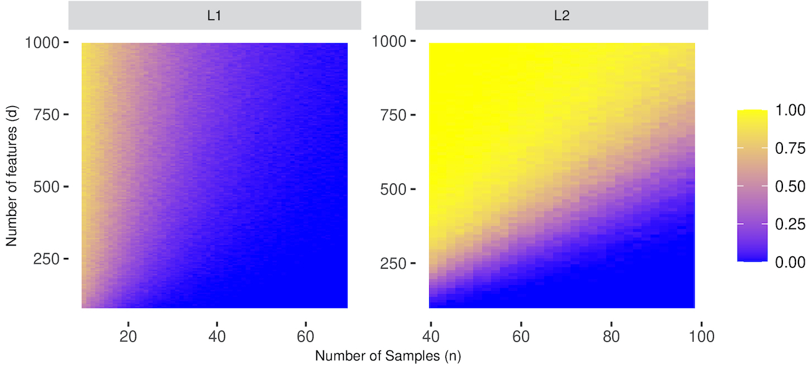

# Support vector machines and linear regression coincide with very high-dimensional features

This repository is the official codebase of [ASH21](https://arxiv.org/abs/2105.14084) . In order to reproduce our figures, we have provided the experiments which we used for the analyses alongside with the code to produce the experiments. 



## Requirements
To install the requirements:
```
pip install -r requirements.txt
```
Our results were obtained in Python 3.8.5 environment.

## Generate Datasets
Python files can be used to generate the datasets. Note that our code has the flexibility to run in parallel; number of cores can be specified, if not the code will run in a serialized fashion. The seed is not fixed in our code.

| File        | Syntax                                                              | Example                             |
|-------------|---------------------------------------------------------------------|-------------------------------------|
| [`l1_svm.py`](l1_svm.py) | `python l1_svm.py <path_to_save_files> <num_cores>`  | `python l1_svm.py "./datasets_l1" 4`|
| [`l2_suite.py`](l2_suite.py) | `python l2_suite.py <path_to_save_files> <num_cores>`  | `python l2_suite.py "./datasets_l2" 4`|

## Analyses
The analyses are done in R where the [R-markdown](NIPS2021.Rmd) file is provided. Please make sure the path to datasets directories are correct (in case one changes the defaults). 


